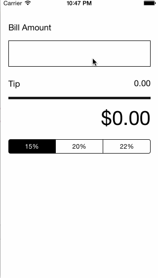

This is Tips demo application for calculating tips at restaurants.

Time spent: 5 hours spent in total

Completed user stories:

	•	 Required: Watch Swift intro video and tutorial video
	•	 Required: User can calculate tips based on the bill amount they entered
	•	 Required: User can switch between different tip percentages 
	•	 Optional:  Added an app icon and launch image
	•	 Optional:  Changed colors and fonts of views and elements. 

Required User Stories:

Updated App with some optional features:  

 
