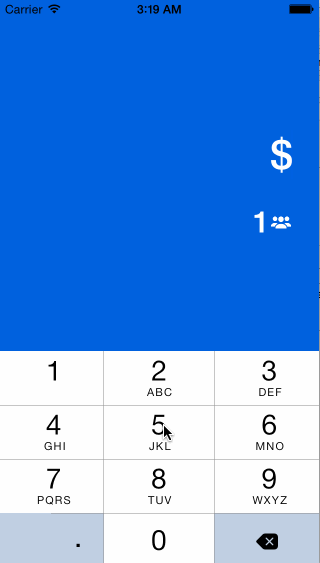

Added more features in the Tips Calculator App

1. Display keyboard by default when user lands on the page instead of tapping on the billAmount field first to trigger the keyboard.
2. Hide all unnecessary elements by default and once user starts editing, the restults will fly into view. 
3. Simplified the default UI to include only two fields - billAmount and No. of people. 

I experienced an issue: After I made these chagnes, my app stopped doing all the calculations. Help needed!!

